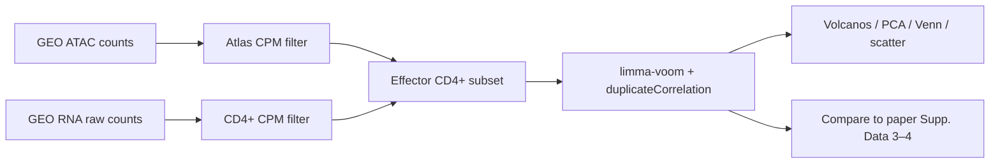

# Effector CD4⁺ T cell ATAC–RNA integration (limma–voom)

Re-analysis of **stimulated vs resting Effector CD4⁺ T cells** from the human immune cell atlas ([Calderon et al.](https://www.ncbi.nlm.nih.gov/geo/query/acc.cgi?acc=GSE118165); ATAC [GSE118189](https://www.ncbi.nlm.nih.gov/geo/query/acc.cgi?acc=GSE118189)), using **GEO raw count matrices** and methods aligned to the paper (**TMM**, **voom**, **limma**, BH *q* &lt; 0.01, |log₂FC| &gt; 1).

---

## What this repository contains

| Item | Description |
|------|-------------|
| `01_matrices_metadata.Rmd` | Inspect ATAC/RNA inputs, build `sample_metadata.txt`, export Effector CD4⁺ sample IDs (~1 min) |
| `02_effector_cd4_limma_PCA_integration.Rmd` | PCA, differential ATAC/RNA, integration plots, comparison to paper supplementary tables (~8 min) |
| `01_matrices_metadata.html` / `02_effector_cd4_limma_PCA_integration.html` | Pre-rendered reports (open in a browser) |
| `results/` | PCA, volcano, Venn, and integration figures (PDF/PNG) |
| `sample_metadata.txt` | Sample × cell type × condition × assay flags |
| `Supplementary_data_3_ATAC_stimulation_DA_peaks.txt` | Paper ATAC DA table (~40 MB; peak-level logFC comparison) |
| `Supplementary_data_4_RNA_stimulation_DE_genes.txt` | Paper RNA DE table (gene-level logFC comparison) |

GEO count matrices and `Supplementary_tables.xlsx` are **not** committed: see [`data/README.md`](data/README.md).

---

## Quick start

```bash
# 1. Clone and enter the repo
git clone https://github.com/emrunali/atac-rna-effector-cd4.git
cd atac-rna-effector-cd4

# 2. Download GEO / supplementary files into data/ (see data/README.md)

# 3. Install R packages (Bioconductor): limma, edgeR, ChIPseeker, TxDb.Hsapiens.UCSC.hg19.knownGene, org.Hs.eg.db, ...

# 4. Render notebooks (watch chunk progress with quiet = FALSE)
Rscript -e 'rmarkdown::render("01_matrices_metadata.Rmd", quiet = FALSE)'
Rscript -e 'rmarkdown::render("02_effector_cd4_limma_PCA_integration.Rmd", quiet = FALSE)'
```

Requires **Pandoc** for HTML (`brew install pandoc` on macOS).

---

## Analysis workflow



---

## Methods (aligned with the paper)

| Step | Paper | This repository |
|------|--------|-----------------|
| RNA quantification | Kallisto + **tximport** estimated counts (Gencode v25) | **NCBI raw counts** from GSE118165 (`GSE118165_raw_counts_GRCh38.p13_NCBI.tsv.gz`) |
| Gene filter | Protein-coding, then **CPM &gt; 10** in ≥2 replicates → **13,512** genes tested | **CPM &gt; 10** on CD4⁺ columns first, then **protein-coding** via Entrez → **7,644** genes tested |
| ATAC filter | **CPM ≥ 1** in ≥2 samples on **full atlas** → **671,448** peaks | Same rule → **734,428** peaks tested (GEO peak set) |
| Normalization | **TMM** | **TMM** |
| Testing | **voom** + **limma** | **voom** + **limma** |
| RNA design | **Donor** in design matrix | **6 libraries** → donor via **`duplicateCorrelation(block = donor)`** + `~ condition` |
| ATAC design | **Donor + TSS enrichment** | **`~ tss_z + condition`** + **`duplicateCorrelation(block = donor)`** |
| Significance | BH **q &lt; 0.01**, **\|log₂FC\| &gt; 1** | Same thresholds |

---

## Why counts differ from the paper figures

1. **Sample depth** — Only **6** Effector CD4⁺ libraries are present in both GEO matrices (donors 1001, 1002, 1003, 1004; **1002** lacks resting, **1004** lacks stimulated). The paper reports up to **four donors** with balanced resting/stimulated pairs per cell type.
2. **RNA matrix** — Paper **tximport** counts on Ensembl IDs vs GEO **NCBI Entrez** raw counts → fewer genes pass **CPM &gt; 10** (7,644 vs 13,512).
3. **Filter order (RNA)** — Paper: protein-coding then CPM. Here: **CPM then protein-coding** (same as internal atlas notebooks; modest effect on gene count).
4. **Peak / gene universe** — Slightly different consensus peak and gene catalogs on GEO vs in-house processing.

Despite different **numbers** of significant features, **effect sizes agree strongly** with the publication tables where features overlap.

---

## Results summary (Effector CD4⁺ T, stimulated vs resting)

| Metric | This analysis | Calderon et al. (reported) |
|--------|---------------|----------------------------|
| RNA libraries | 6 | ~8 (4 donors × 2 conditions) |
| Genes tested | 7,644 | 13,512 |
| **DEGs** (q&lt;0.01, \|log₂FC\|&gt;1) | **170 up / 105 down** (275 total) | **584 up / 282 down** |
| Peaks tested | 734,428 | 671,448 |
| **DARs** (q&lt;0.01, \|log₂FC\|&gt;1) | **18,707 up / 2,047 down** (20,754 total) | **20,210 up / 2,642 down** |
| Pearson *r* (log₂FC vs paper, overlapping features) | **RNA 0.974** (ENSEMBL join) | — |
| | **ATAC 0.988** (peak_id join) | — |
| Proximal DAR–DEG overlap (±50 kb TSS) | **129 genes** | — |

Pre-rendered outputs: `results/volcano_RNA_effector_CD4.pdf`, `results/pca_*.pdf`, `results/venn_DAR_DEG_effector_CD4.png`, `results/scatter_ATAC_RNA_effector_CD4.pdf` (ATAC volcano is in the HTML report; full-resolution PDF is gitignored due to size).

---

## Biological overlap with the paper

Volcano labels and supplementary-table ranks recover the **expected T cell activation program**, consistent with Calderon et al.:

- **Immediate-early transcription factors:** *FOS*, *FOSB*, *JUN* family (RNA and/or ATAC-linked peaks).
- **Cytokine / effector genes:** *IL2*, *IL21*, and related stimulation-induced transcripts (RNA).
- **Cytotoxic / effector-associated genes** seen in activated T profiles (e.g. *GZMB* in comparable analyses).
- **Th17 / inflammatory axis:** *IL17F* (and related stimulation-induced genes in this subset).
- **Coordinated chromatin–expression changes:** among genes significant in **both** assays at proximal promoters/enhancers, the majority show **open & up** (78 genes) or **open & down** / **closed & down** patterns matching directional accessibility–expression coupling in the paper’s framework (13 closed & down, 36 open & down, 2 closed & up).

Directional overlap (proximal DAR gene × DEG, *n* = 129):

| Pattern | Count |
|---------|------:|
| Open & RNA up | 78 |
| Open & RNA down | 36 |
| Closed & RNA down | 13 |
| Closed & RNA up | 2 |

---

## Repository layout

```
.
├── README.md
├── 01_matrices_metadata.Rmd / .html
├── 02_effector_cd4_limma_PCA_integration.Rmd / .html
├── sample_metadata.txt
├── exported/effector_cd4_sample_ids.txt
├── data/
│   ├── README.md
│   └── GSE118165_GSM_to_sample_id.tsv
├── Supplementary_data_3_ATAC_stimulation_DA_peaks.txt
├── Supplementary_data_4_RNA_stimulation_DE_genes.txt
└── results/
```

---

## Citation

1. Calderon D, Nguyen MLT, Mezger A, Kathiria A, Müller F, Nguyen V, Lescano N, Wu B, Trombetta J, Ribado JV, Knowles DA, Gao Z, Blaeschke F, Parent AV, Burt TD, Anderson MS, Criswell LA, Greenleaf WJ, Marson A, Pritchard JK. Landscape of stimulation-responsive chromatin across diverse human immune cells. Nat Genet. 2019 Oct;51(10):1494-1505. doi: [10.1038/s41588-019-0505-9](https://pmc.ncbi.nlm.nih.gov/articles/PMC6858557/). Epub 2019 Sep 30. PMID: 31570894; PMCID: PMC6858557.

Note: If you use this code, please cite the original atlas publication and GEO accessions **GSE118165** (RNA) and **GSE118189** (ATAC).

---

## License

MIT — see [LICENSE](LICENSE).
